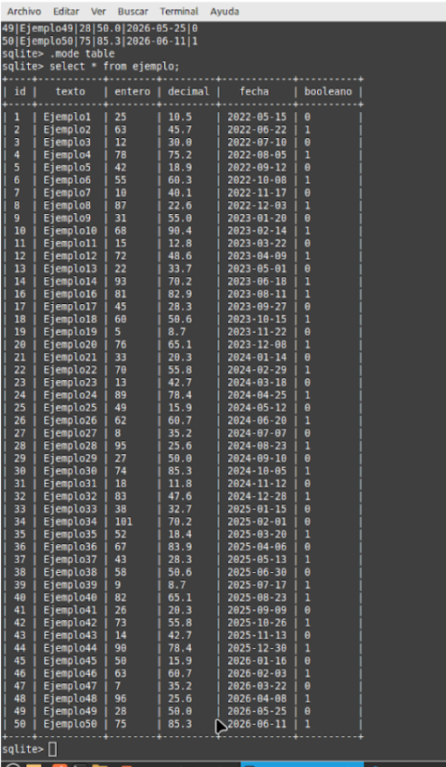

# Mis primeros pasos en SQL

*Para empezar con la creación y manipulación en mi primera base de datos SQLITE3 abriremos la línea de comandos.*

* Dentro de SQLite3, creamos  una tabla llamada Ejemplo con los siguientes campos:

    * id (tipo INTEGER,clave primaria)
    * texto (tipo TEXT)
    * entero (tipo INTEGER)
    * decimal (tipo REAL)
    * fecha (tipo DATE)
    * booleano (tipo BOOLEAN)

*Una vez rellenamos nuestros datos insertaremos las 50 entradas que se nos pide en la tarea. Después de esto, haremos las consultas que se nos pide.*

**1. Obtén todas las entradas de la tabla Ejemplo.**

  

---

**2. Obtén las entradas con el campo entero mayor a 50.**

  

---

**3. Elimina las entradas donde el campo booleano es igual a True.**

  

---

**4. Modifica el campo texto de las entradas donde el campo entero es menor a 30 y establece el texto como "Modificado".**

  

---

**5. Elimina las entradas donde el campo entero es igual a 50.**

  

---

**6.Incrementa en 10 el valor del campo entero para las entradas donde el campo booleano es igual a False.**

  

---

**7. Elimina las entradas donde el campo decimal es menor a 50.**

  

---

**8. Actualiza el campo fecha de todas las entradas a la fecha actual.**

  

