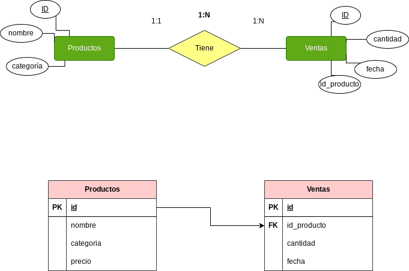

<div align="justify";>

# Tarea 4 sobre sqlite3 funciones de base de datos

<p align="center">
  
</p>


**Responde a las siguientes cuestiones**


1. Realiza el diagrama ER de la BBDD supermercado.
2. Realiza el diagrama MR de la BBDD supermercado.
3. Indica si la BBDD esta normalizada hasta la 3ª forma normal, justificando la respuesta.


### Realiza las siguientes consultas, y muestra el resultado obtenido:

1. Mostrar todos los productos de la categoría "Bebidas".
```sql
select * from productos where categoria like 'Bebidas';
┌────┬──────────────────┬───────────┬────────┐
│ id │      nombre      │ categoria │ precio │
├────┼──────────────────┼───────────┼────────┤
│ 16 │ Café             │ Bebidas   │ 5.0    │
│ 19 │ Botellas de Agua │ Bebidas   │ 1.0    │
│ 20 │ Cerveza          │ Bebidas   │ 3.8    │
└────┴──────────────────┴───────────┴────────┘
```
2. Listar los productos ordenados por precio de forma descendente.
```sql
 select * from  productos order by  precio desc;
┌────┬────────────────────┬───────────┬────────┐
│ id │       nombre       │ categoria │ precio │
├────┼────────────────────┼───────────┼────────┤
│ 5  │ Pollo              │ Carnes    │ 5.5    │
│ 16 │ Café               │ Bebidas   │ 5.0    │
│ 15 │ Aceite de Oliva    │ Cocina    │ 4.5    │
│ 9  │ Queso              │ Lácteos   │ 4.0    │
│ 20 │ Cerveza            │ Bebidas   │ 3.8    │
│ 10 │ Cereal             │ Desayuno  │ 3.5    │
│ 4  │ Manzanas           │ Frutas    │ 3.0    │
│ 13 │ Detergente         │ Limpieza  │ 2.8    │
│ 1  │ Arroz              │ Alimentos │ 2.5    │
│ 17 │ Sopa enlatada      │ Conservas │ 2.3    │
│ 8  │ Tomates            │ Verduras  │ 2.2    │
│ 7  │ Yogurt             │ Lácteos   │ 2.0    │
│ 12 │ Cepillo de Dientes │ Higiene   │ 2.0    │
│ 2  │ Leche              │ Lácteos   │ 1.8    │
│ 14 │ Galletas           │ Snacks    │ 1.7    │
│ 11 │ Papel Higiénico    │ Hogar     │ 1.5    │
│ 3  │ Pan                │ Panadería │ 1.2    │
│ 18 │ Jabón de Baño      │ Higiene   │ 1.2    │
│ 6  │ Huevos             │ Lácteos   │ 1.0    │
│ 19 │ Botellas de Agua   │ Bebidas   │ 1.0    │
└────┴────────────────────┴───────────┴────────┘
```
3. Calcular el precio total de todos los productos en la tabla "productos".
```sql
select sum(precio) as suma_precio from productos;
┌─────────────┐
│ suma_precio │
├─────────────┤
│ 52.5        │
└─────────────┘
```

4. Encontrar los productos con un nombre que contenga la letra 'a'.
```sql
select * from productos where nombre like '%a%';
┌────┬──────────────────┬───────────┬────────┐
│ id │      nombre      │ categoria │ precio │
├────┼──────────────────┼───────────┼────────┤
│ 1  │ Arroz            │ Alimentos │ 2.5    │
│ 3  │ Pan              │ Panadería │ 1.2    │
│ 4  │ Manzanas         │ Frutas    │ 3.0    │
│ 8  │ Tomates          │ Verduras  │ 2.2    │
│ 10 │ Cereal           │ Desayuno  │ 3.5    │
│ 11 │ Papel Higiénico  │ Hogar     │ 1.5    │
│ 14 │ Galletas         │ Snacks    │ 1.7    │
│ 15 │ Aceite de Oliva  │ Cocina    │ 4.5    │
│ 16 │ Café             │ Bebidas   │ 5.0    │
│ 17 │ Sopa enlatada    │ Conservas │ 2.3    │
│ 18 │ Jabón de Baño    │ Higiene   │ 1.2    │
│ 19 │ Botellas de Agua │ Bebidas   │ 1.0    │
│ 20 │ Cerveza          │ Bebidas   │ 3.8    │
└────┴──────────────────┴───────────┴────────┘
```

5. Obtener la cantidad total de productos vendidos en todas las fechas.

```sql
select sum(cantidad) as  suma_producto from ventas;
┌───────────────┐
│ suma_producto │
├───────────────┤
│ 43            │
└───────────────┘
```
6. Encontrar el producto más caro en cada categoría.
```sql
select categoria, max(precio) from productos group by categoria;
┌───────────┬─────────────┐
│ categoria │ max(precio) │
├───────────┼─────────────┤
│ Alimentos │ 2.5         │
│ Bebidas   │ 5.0         │
│ Carnes    │ 5.5         │
│ Cocina    │ 4.5         │
│ Conservas │ 2.3         │
│ Desayuno  │ 3.5         │
│ Frutas    │ 3.0         │
│ Higiene   │ 2.0         │
│ Hogar     │ 1.5         │
│ Limpieza  │ 2.8         │
│ Lácteos   │ 4.0         │
│ Panadería │ 1.2         │
│ Snacks    │ 1.7         │
│ Verduras  │ 2.2         │
└───────────┴─────────────┘
```

7. Listar los productos que no han sido vendidos.
```sql
 select * from  productos where id not in (select p.id from productos as p, ventas as v where p.id = v.id_producto);
┌────┬────────────────────┬───────────┬────────┐
│ id │       nombre       │ categoria │ precio │
├────┼────────────────────┼───────────┼────────┤
│ 3  │ Pan                │ Panadería │ 1.2    │
│ 7  │ Yogurt             │ Lácteos   │ 2.0    │
│ 9  │ Queso              │ Lácteos   │ 4.0    │
│ 11 │ Papel Higiénico    │ Hogar     │ 1.5    │
│ 12 │ Cepillo de Dientes │ Higiene   │ 2.0    │
│ 13 │ Detergente         │ Limpieza  │ 2.8    │
│ 15 │ Aceite de Oliva    │ Cocina    │ 4.5    │
│ 17 │ Sopa enlatada      │ Conservas │ 2.3    │
│ 19 │ Botellas de Agua   │ Bebidas   │ 1.0    │
│ 20 │ Cerveza            │ Bebidas   │ 3.8    │
└────┴────────────────────┴───────────┴────────┘
```

8. Calcular el precio promedio de los productos en la categoría "Snacks".
```sql
select avg(precio) as precio_promedio from productos  where categoria = 'Snacks';
┌─────────────────┐
│ precio_promedio │
├─────────────────┤
│ 1.7             │
└─────────────────┘
```

9. Encontrar los productos que han sido vendidos más de 5 veces.

```sql
select id_producto,cantidad from ventas where cantidad >= 5;
┌─────────────┬──────────┐
│ id_producto │ cantidad │
├─────────────┼──────────┤
│ 1           │ 5        │
│ 6           │ 10       │
│ 14          │ 7        │
│ 18          │ 6        │
└─────────────┴──────────┘
```

10. Mostrar la fecha y la cantidad de ventas para cada producto.
```sql
select id_producto, current_date, cantidad from ventas;
┌─────────────┬──────────────┬──────────┐
│ id_producto │ current_date │ cantidad │
├─────────────┼──────────────┼──────────┤
│ 1           │ 2024-01-18   │ 5        │
│ 2           │ 2024-01-18   │ 3        │
│ 4           │ 2024-01-18   │ 2        │
│ 5           │ 2024-01-18   │ 1        │
│ 6           │ 2024-01-18   │ 10       │
│ 8           │ 2024-01-18   │ 4        │
│ 10          │ 2024-01-18   │ 2        │
│ 14          │ 2024-01-18   │ 7        │
│ 16          │ 2024-01-18   │ 3        │
│ 18          │ 2024-01-18   │ 6        │
└─────────────┴──────────────┴──────────┘
```

11. Encontrar los productos que tienen un precio menor o igual a 2.
```sql
select nombre, precio from productos where precio <= 2;
┌────────────────────┬────────┐
│       nombre       │ precio │
├────────────────────┼────────┤
│ Leche              │ 1.8    │
│ Pan                │ 1.2    │
│ Huevos             │ 1.0    │
│ Yogurt             │ 2.0    │
│ Papel Higiénico    │ 1.5    │
│ Cepillo de Dientes │ 2.0    │
│ Galletas           │ 1.7    │
│ Jabón de Baño      │ 1.2    │
│ Botellas de Agua   │ 1.0    │
└────────────────────┴────────┘
```

12. Calcular la cantidad total de ventas para cada fecha.

```sql
select fecha, sum(cantidad) as suma_total from ventas group by fecha;
┌────────────┬────────────┐
│   fecha    │ suma_total │
├────────────┼────────────┤
│ 2024-01-17 │ 11         │
│ 2024-01-18 │ 16         │
│ 2024-01-19 │ 10         │
│ 2024-01-20 │ 6          │
└────────────┴────────────┘
```
13. Listar los productos cuyo nombre comienza con la letra 'P'.
```sql
select substr(nombre, 1) as inicial from productos where nombre like '%p%';
┌────────────────────┐
│      inicial       │
├────────────────────┤
│ Pan                │
│ Pollo              │
│ Papel Higiénico    │
│ Cepillo de Dientes │
│ Sopa enlatada      │
└────────────────────┘
```

14. Obtener el producto más vendido en términos de cantidad.

```sql
select p.nombre as nombre_producto,sum (v.cantidad) as total_vendido
from productos p join ventas v on p.id = v.id_producto group by p.id, p.nombre order by total_vendido desc limit 1;
┌─────────────────┬───────────────┐
│ nombre_producto │ total_vendido │
├─────────────────┼───────────────┤
│ Huevos          │ 10            │
└─────────────────┴───────────────┘
```
15. Mostrar los productos que fueron vendidos en la fecha '2024-01-18'.
```sql
 select p.id, p.nombre as nombre_producto, v.cantidad, v.fecha from productos p join ventas v on p.id = v.id_producto where v.fecha = '2024-01-18';
┌────┬─────────────────┬──────────┬────────────┐
│ id │ nombre_producto │ cantidad │   fecha    │
├────┼─────────────────┼──────────┼────────────┤
│ 6  │ Huevos          │ 10       │ 2024-01-18 │
│ 8  │ Tomates         │ 4        │ 2024-01-18 │
│ 10 │ Cereal          │ 2        │ 2024-01-18 │
└────┴─────────────────┴──────────┴────────────┘
```
16. Calcular el total de ventas para cada producto.
```sql
select p.id as id_producto, p.nombre as nombre_producto,sum(v.cantidad) as total_vendido from productos p join ventas v on p.id = v.id_producto group by id_producto, p.nombre;

┌─────────────┬─────────────────┬───────────────┐
│ id_producto │ nombre_producto │ total_vendido │
├─────────────┼─────────────────┼───────────────┤
│ 1           │ Arroz           │ 5             │
│ 2           │ Leche           │ 3             │
│ 4           │ Manzanas        │ 2             │
│ 5           │ Pollo           │ 1             │
│ 6           │ Huevos          │ 10            │
│ 8           │ Tomates         │ 4             │
│ 10          │ Cereal          │ 2             │
│ 14          │ Galletas        │ 7             │
│ 16          │ Café            │ 3             │
│ 18          │ Jabón de Baño   │ 6             │
└─────────────┴─────────────────┴───────────────┘
```
17. Encontrar los productos con un precio entre 3 y 4.
```sql
select nombre as nombre_producto, categoria from productos order by categoria;
┌────────────────────┬───────────┐
│  nombre_producto   │ categoria │
├────────────────────┼───────────┤
│ Arroz              │ Alimentos │
│ Café               │ Bebidas   │
│ Botellas de Agua   │ Bebidas   │
│ Cerveza            │ Bebidas   │
│ Pollo              │ Carnes    │
│ Aceite de Oliva    │ Cocina    │
│ Sopa enlatada      │ Conservas │
│ Cereal             │ Desayuno  │
│ Manzanas           │ Frutas    │
│ Cepillo de Dientes │ Higiene   │
│ Jabón de Baño      │ Higiene   │
│ Papel Higiénico    │ Hogar     │
│ Detergente         │ Limpieza  │
│ Leche              │ Lácteos   │
│ Huevos             │ Lácteos   │
│ Yogurt             │ Lácteos   │
│ Queso              │ Lácteos   │
│ Pan                │ Panadería │
│ Galletas           │ Snacks    │
│ Tomates            │ Verduras  │
└────────────────────┴───────────┘

```
18. Listar los productos y sus categorías ordenados alfabéticamente por categoría.
```sql
select
    nombre as nombre_producto,
    categoria
from
    productos
order by
    categoria;
┌────────────────────┬───────────┐
│  nombre_producto   │ categoria │
├────────────────────┼───────────┤
│ Arroz              │ Alimentos │
│ Café               │ Bebidas   │
│ Botellas de Agua   │ Bebidas   │
│ Cerveza            │ Bebidas   │
│ Pollo              │ Carnes    │
│ Aceite de Oliva    │ Cocina    │
│ Sopa enlatada      │ Conservas │
│ Cereal             │ Desayuno  │
│ Manzanas           │ Frutas    │
│ Cepillo de Dientes │ Higiene   │
│ Jabón de Baño      │ Higiene   │
│ Papel Higiénico    │ Hogar     │
│ Detergente         │ Limpieza  │
│ Leche              │ Lácteos   │
│ Huevos             │ Lácteos   │
│ Yogurt             │ Lácteos   │
│ Queso              │ Lácteos   │
│ Pan                │ Panadería │
│ Galletas           │ Snacks    │
│ Tomates            │ Verduras  │
└────────────────────┴───────────┘
```
19. Calcular el precio total de los productos vendidos en la fecha '2024-01-19'.
```sql
select
    sum(precio * cantidad) as precio_total
from
    productos p
join
    ventas v on p.id = v.id_producto
where
    v.fecha = '2024-01-19';
┌──────────────┐
│ precio_total │
├──────────────┤
│ 26.9         │
└──────────────┘
```
20. Mostrar los productos que no pertenecen a la categoría "Higiene".
```sql
select
    nombre as nombre_producto,
    categoria
from
    productos
where
    categoria != 'Higiene';
┌──────────────────┬───────────┐
│ nombre_producto  │ categoria │
├──────────────────┼───────────┤
│ Arroz            │ Alimentos │
│ Leche            │ Lácteos   │
│ Pan              │ Panadería │
│ Manzanas         │ Frutas    │
│ Pollo            │ Carnes    │
│ Huevos           │ Lácteos   │
│ Yogurt           │ Lácteos   │
│ Tomates          │ Verduras  │
│ Queso            │ Lácteos   │
│ Cereal           │ Desayuno  │
│ Papel Higiénico  │ Hogar     │
│ Detergente       │ Limpieza  │
│ Galletas         │ Snacks    │
│ Aceite de Oliva  │ Cocina    │
│ Café             │ Bebidas   │
│ Sopa enlatada    │ Conservas │
│ Botellas de Agua │ Bebidas   │
│ Cerveza          │ Bebidas   │
└──────────────────┴───────────┘
```
21. Encontrar la cantidad total de productos en cada categoría.
```sql
select
    categoria,
    count(*) as cantidad_total
from
    productos
group by
    categoria;
┌───────────┬────────────────┐
│ categoria │ cantidad_total │
├───────────┼────────────────┤
│ Alimentos │ 1              │
│ Bebidas   │ 3              │
│ Carnes    │ 1              │
│ Cocina    │ 1              │
│ Conservas │ 1              │
│ Desayuno  │ 1              │
│ Frutas    │ 1              │
│ Higiene   │ 2              │
│ Hogar     │ 1              │
│ Limpieza  │ 1              │
│ Lácteos   │ 4              │
│ Panadería │ 1              │
│ Snacks    │ 1              │
│ Verduras  │ 1              │
└───────────┴────────────────┘
```
22. Listar los productos que tienen un precio igual a la media de precios.

```sql
select
    nombre as nombre_producto,
    precio
from
    productos
where
    precio = (select avg(precio) from productos);
```

23. Calcular el precio total de los productos vendidos en cada fecha.

```sql
 select
    fecha,
    sum(precio * cantidad) as precio_total
from
    productos p
join
    ventas v on p.id = v.id_producto
group by
    fecha;
┌────────────┬──────────────┐
│   fecha    │ precio_total │
├────────────┼──────────────┤
│ 2024-01-17 │ 29.4         │
│ 2024-01-18 │ 25.8         │
│ 2024-01-19 │ 26.9         │
│ 2024-01-20 │ 7.2          │
└────────────┴──────────────┘
```
24. Mostrar los productos con un nombre que termina con la letra 'o'.
```sql
 select
    nombre as nombre_producto
from
    productos
where
    nombre like '%o';
┌─────────────────┐
│ nombre_producto │
├─────────────────┤
│ Pollo           │
│ Queso           │
│ Papel Higiénico │
│ Jabón de Baño   │
└─────────────────┘
```
25. Encontrar los productos que han sido vendidos en más de una fecha.
```sql
select
    nombre as nombre_producto
from
    productos p
join
    ventas v on p.id = v.id_producto
group by
    p.id, p.nombre
having
    count(distinct v.fecha) > 1;
sqlite> 
```
26. Listar los productos cuya categoría comienza con la letra 'L'.
```sql
select
    nombre as nombre_producto,
    categoria
from
    productos
where
    categoria like 'L%';
┌─────────────────┬───────────┐
│ nombre_producto │ categoria │
├─────────────────┼───────────┤
│ Leche           │ Lácteos   │
│ Huevos          │ Lácteos   │
│ Yogurt          │ Lácteos   │
│ Queso           │ Lácteos   │
│ Detergente      │ Limpieza  │
└─────────────────┴───────────┘
```
27. Calcular el total de ventas para cada producto en la fecha '2024-01-17'.
```sql
select
    p.nombre as nombre_producto,
    sum(v.cantidad) as total_vendido
from
    productos p
join
    ventas v on p.id = v.id_producto
where
    v.fecha = '2024-01-17'
group by
    p.id, p.nombre;
┌─────────────────┬───────────────┐
│ nombre_producto │ total_vendido │
├─────────────────┼───────────────┤
│ Arroz           │ 5             │
│ Leche           │ 3             │
│ Manzanas        │ 2             │
│ Pollo           │ 1             │
└─────────────────┴───────────────┘
```
28. Mostrar los productos cuyo nombre tiene al menos 5 caracteres.
```sql
select
    nombre as nombre_producto
from
    productos
where
    length(nombre) >= 5;
┌────────────────────┐
│  nombre_producto   │
├────────────────────┤
│ Arroz              │
│ Leche              │
│ Manzanas           │
│ Pollo              │
│ Huevos             │
│ Yogurt             │
│ Tomates            │
│ Queso              │
│ Cereal             │
│ Papel Higiénico    │
│ Cepillo de Dientes │
│ Detergente         │
│ Galletas           │
│ Aceite de Oliva    │
│ Sopa enlatada      │
│ Jabón de Baño      │
│ Botellas de Agua   │
│ Cerveza            │
└────────────────────┘
```
29. Encontrar los productos que tienen un precio superior al precio máximo en la tabla "productos".
```sql
select
    nombre as nombre_producto,
    precio
from
    productos
where
    precio > (select max(precio) from productos);
```
</div>


<div align="justify";>

### El modelo entidad relación y modelo relacional



> como podemos observar la cardinalidad entre productos-venta es de 1:N. Siendo 'Ventas' quien recibirá la clave foránea **(FK)** 

</div>


### Normalización

#### Primera Forma Normal (1FN):
- Cada atributo contiene un solo valor, y no hay grupos repetitivos de atributos.

- Ya cumple con 1FN, ya que cada celda de la tabla contiene un solo valor y no hay conjuntos repetitivos de atributos.
#### Segunda Forma Normal (2FN):
- Está en 1FN, y todos los atributos no clave son completamente dependientes de la clave primaria.

- Cumple con 2FN si asumimos que "id_producto" es una clave compuesta de "Ventas".


#### Tercera Forma Normal (3FN):
- Está en 2FN, y no hay dependencias transitivas.

- Podría haber una dependencia transitiva entre "nombre" y "categoria" en "Productos". Para 3FN, podríamos crear una tabla separada para "Categorías".
Esquema propuesto después de la tercera normalización:

|Productos         |   
|-------------------|        
| id (PK)           |        
| nombre            |         
| id_categoria (FK) |
| precio            | 

| id (PK)           | 
|-------------------| 
| id_producto (FK)  | 
| cantidad          | 
| fecha             | 

| id (PK)           | 
|-------------------| 
| categoria         | 
