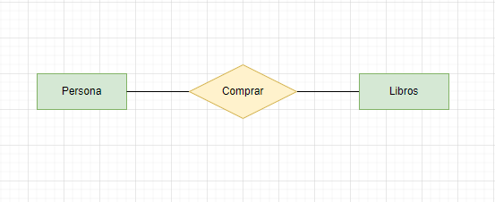
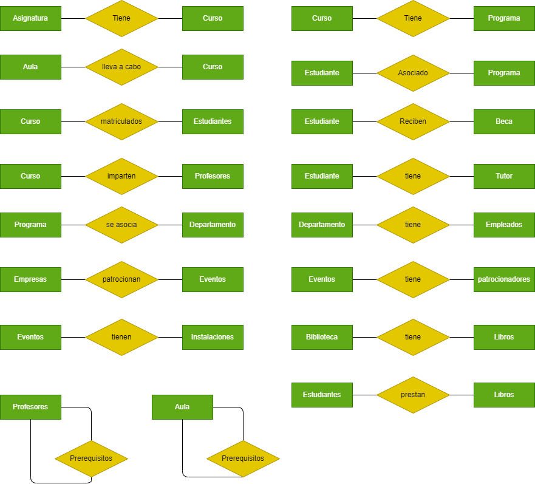

# Modelo Entidad Relación

Nuestra primera parada, en cualquier creación de Base de Datos, es la ejecución del modelo entidad-relación. Este consiste en hacer un diagrama general de las entidades y relaciones que competen en un texto o descripción aportado. 

Las entidades son los sujetos que van dirigidas las relaciones o acciones a ejecutar. Un ejemplo básico de una base de datos de una libreria sería:

> Personas compran libros. Las personas serían una de las entidades y libros la siguiente. Estas son unidas por comprar, la relación que las unen.

  

Las entidades se representan mediante rectángulos, y las relaciones se indican con líneas que conectan las entidades relacionadas. Cada entidad tiene atributos que describen sus propiedades. En el ejemplo anterior, la persona puede tener atributos como nombre, dirección y número de teléfono.

## Entidad Relación

A continuación, expondremos nuestro ejercicio como tal. Pero antes, mostraremos las entidades por separado para su entendimiento más claro. 

Nuestro ejercicio trata de resolver el problema planteado en el siguiente enlance de github, proporcionado por nuestro profesor.
- [Enunciado del ejercicio](https://github.com/jpexposito/docencia/tree/master/Primero/BAE/PROYECTO)

Nosotros hemos visto conveniente poner todas las entidades con sus respectivas relaciones por separado primero. Esto nos da la facilidad de entendimiento, para que puedas entender las cardinalidades y flujos del diagrama completo.

Como se ve en la siguiente imagen, tenemos en total de 15 entidades. Añadir, que no hemos puesto las cardinalidades en esta imagen para que no fuera más liosa, ya que hay una cantidad elevada de entidades y relaciones.

### Ejercicio Completo
Seguidamente, vamos a mostrar el ejercicio completo, con sus entidades, relaciones ,cardinalidades y con sus atributos. Es importante observar que ejercicios como este, largos, debemos tener claro que las entidades con más relaciones, en este caso estudiantes y curso, deberemos ponerlas en el medio del diagrama. Esto nos ayuda a su entendimiento y lectura del diagrama.

---
### Ejercicios por separados
Si es necesario ampliarlos para observarlos con más detenimiento, se añaden en los siguientes enlaces:

- [Entidades agrupadas](img/entidades.png)
- [Ejercicio Completo](img/Sistema%20de%20Gestión%20de%20una%20Universidad%20drawio.png)
- [Ejemplo 1](img/ejemplo1_er.png)

