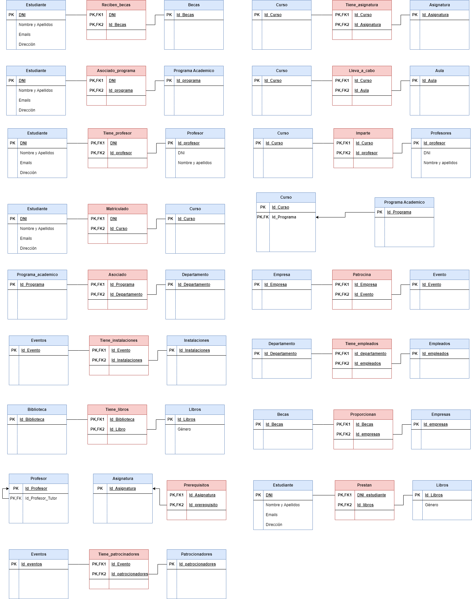
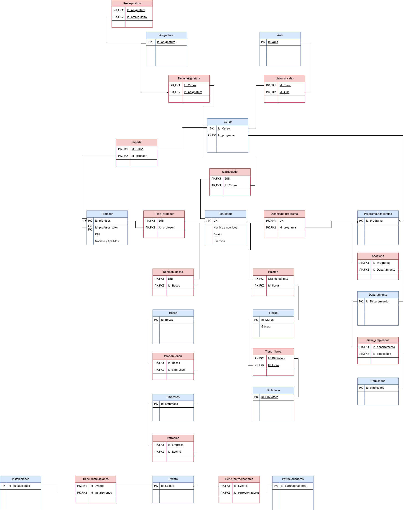

# Modelo Relacional
Este es el segundo paso que tenemos que seguir en la creación de cualquier Base de Datos.

El modelo relacional se encarga de coger el paso anterior (modelo entidad relación) y completarlo para su posterior corrección con la normalización. En sí, el modelo relacional crea las tablas de cada entidad, junto con sus propiedades y sus relaciones con las demás entidades.

Las relaciones en el modelo relacional están interconectadas mediantes claves, que son identificadores únicos asosciados a cada fila. Estas claves permiten establecer relaciones entre diferentes tablas, lo que facilita la integración y recuperación de datos de manera eficiente. Además, el modelo relacional impone reglas de integridad para garantizar la coherencia y consistencia de la información almacenada. 

Es cierto que este módelo lo más importante serían las cardinalidades, pues con una cardinalidad máxima creará o no tabla, algo verdaderamente importante para su implantación correcta.

En un ejemplo básico sería el siguiente: 
Cogiendo el ejemplo anterior, persona compra libro quedaría de la siguiente manera:

## Ejercicio Completo
Basando en el modelo Entidad Relación ya hecho, como hemos dicho anteriormente, este sería el segundo paso en cualquier creación de una Base de Datos. Por lo tanto, y como en el anterior, dividimos la tarea. Por un lado, las entidades y relaciones. Y por el otro lado, el ejercicio completo.

### Entidades separadas
Como se muestra a continuación, hemos expuestos todas las entidades con sus respectivas propiedades siguiendo sus cardinalidades para completar sus relaciones.

### Ejercicio Modelo Relacional
Ahora adjuntamos el ejercicio, ya completado, del modelo Relacional. Como se puede observar, es muy parecido al entidad relación, salvando su aspecto, la organización es la misma.

## Ejercicios por separado
Como en el caso anterior, por si que quiere ampliar y analizar por separado

- [Entidades separadas](img/modelo_relacional_separado.drawio.png)
- [Modelo Relacional](img/modelo_relacional.drawio.png)
- [Ejemplo 2](img/Ejemplo%202.png)

